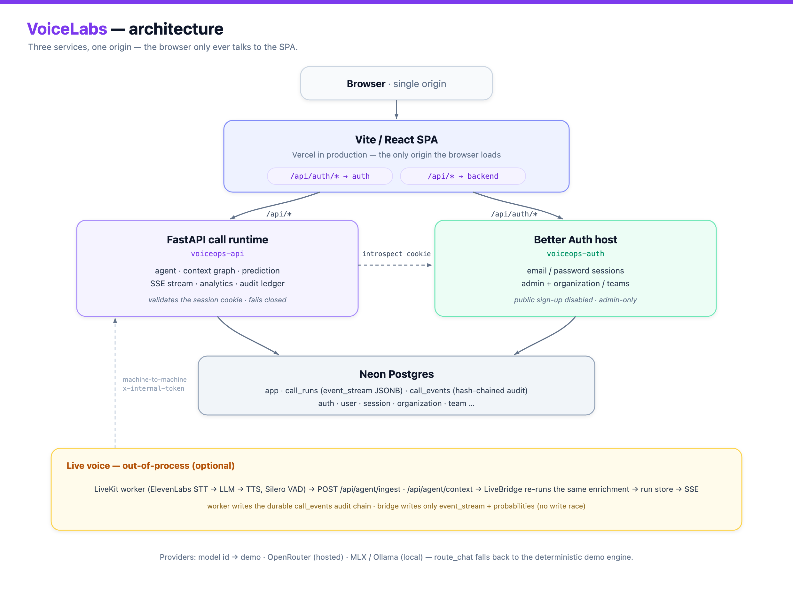

# VoiceLabs

**An operations platform for tool-using voice agents.** A reasoning model runs a
real, unscripted call — phone or text — against your **live system of record**,
not canned answers. Every turn is grounded by a deterministic **context graph**
built from the *same* tables the agent's tools read, a fast **anticipation model**
forecasts the next exchange and warms the data behind it off the critical path,
and the entire call streams to a live cockpit over SSE with a **tamper‑evident
audit trail**.

VoiceLabs is **domain‑agnostic**. A single generic orchestrator drives any
vertical through a small `Pack` contract; the repo ships **Healthcare payer‑ops**
(the DB‑backed reference domain), **Banking**, **Telecom**, and **user‑authored
custom** scenarios. Adding a new domain is authoring scenarios plus a label — no
orchestrator changes.

> **Why this exists.** The most dangerous failure mode for a voice agent is
> stating something *confidently wrong*. VoiceLabs attacks that by construction:
> the agent learns nothing without calling a real tool, the context graph it's
> grounded on is derived from the exact same source of truth, and every fact it
> touches is hash‑chained into an auditable ledger. Speculation (prediction /
> prefetch) is kept strictly off the correctness path — a wrong guess wastes a
> little local compute and nothing else.

---

## Table of contents

- [What makes it interesting](#what-makes-it-interesting)
- [Architecture](#architecture)
  - [System topology](#system-topology)
  - [Anatomy of one call](#anatomy-of-one-call)
- [Context strategy: the context graph](#context-strategy-the-context-graph)
- [The anticipation model](#the-anticipation-model)
- [The conversation loop](#the-conversation-loop-two-models-streamed-reasoning-a-safety-guard)
- [Domain packs: one engine, many verticals](#domain-packs-one-engine-many-verticals)
- [Trust & compliance: the audit chain and PHI scoping](#trust--compliance-the-audit-chain-and-phi-scoping)
- [Live voice == simulate, by construction](#live-voice--simulate-by-construction)
- [The cockpit](#the-cockpit)
- [Security & multi‑service topology](#security--multi-service-topology)
- [Resilience: a feature fails, never the call](#resilience-a-feature-fails-never-the-call)
- [Tech stack](#tech-stack)
- [Repository layout](#repository-layout)
- [Run it locally](#run-it-locally)
- [Configuration](#configuration)
- [Testing, CI/CD & deploy](#testing-cicd--deploy)
- [What's real vs. demo (honest scope)](#whats-real-vs-demo-honest-scope)

---

## What makes it interesting

| # | Theme | The idea |
|---|-------|----------|
| 1 | **Context graph == ground truth, by construction** | The per‑call knowledge graph is built from the **same tables, keyed on the same id**, that the agent's SQL tools read. Grounding is consistency‑by‑shared‑source, not consistency‑by‑reconciliation — injected context can never disagree with a tool result. |
| 2 | **Anticipation off the critical path** | A fast predictor runs via `asyncio.create_task` (cancel‑on‑supersede) and speculatively warms **idempotent reads** only. The authoritative tool always runs; a hit is a pure latency win, a miss is wasted compute — never a correctness risk. |
| 3 | **A tamper‑evident audit chain, byte‑identical in three runtimes** | An append‑only SHA‑256 hash chain is re‑implemented with an identical canonical pre‑image in the FastAPI backend, the dependency‑free LiveKit worker, and the browser — so a server‑emitted ledger re‑verifies byte‑for‑byte client‑side. |
| 4 | **Live voice reaches full cockpit parity** | A real LiveKit call (ElevenLabs STT→LLM→TTS) is a thin forwarder; a backend `LiveBridge` re‑runs the *same* graph + prediction + reasoning enrichment so the cockpit can't tell a live call from a simulated one. |
| 5 | **Real, not mocked** | The agent must call live SQL tools to learn anything; the simulated counterparty is fenced to the same rows. Analytics, call history, and the audit ledger are computed 100% from persisted runs. |
| 6 | **One `Pack` contract, many verticals** | The orchestrator knows nothing domain‑specific. Healthcare/Banking/Telecom/Custom all plug into the same loop, guard, prediction, and audit machinery. |
| 7 | **Graceful degradation everywhere** | DB down → scenario‑only graph; provider unconfigured → deterministic demo engine; persistence error → a `persist warning`, not a dropped call; auth host unreachable → **fail‑closed** 401. |

---

## Architecture

VoiceLabs is **three independently deployable services that the browser only ever
sees as one origin**, plus an optional out‑of‑process voice worker.

| Dir | Stack | Port | Role |
|-----|-------|------|------|
| [`web/`](web) | Vite + React + TanStack Router/Query | 5173 | Cockpit SPA — the only thing the browser loads |
| [`backend/`](backend) | Python + FastAPI | 8000 | Call runtime, context graph, prediction, SSE stream, analytics, audit, scenarios, providers |
| [`auth-server/`](auth-server) | Node + Better Auth | 3000 | Identity: email/password sessions, admin + organization/teams plugins |
| [`agent/`](agent) | Python + LiveKit | — | Out‑of‑process voice worker (ElevenLabs STT/TTS, Silero VAD) — optional |

A **same‑origin proxy** splits two path prefixes — `/api/auth/*` → the auth host,
everything else `/api/*` → the backend — implemented identically by the Vite dev
proxy ([`web/vite.config.ts`](web/vite.config.ts)) and Vercel rewrites
([`web/vercel.json`](web/vercel.json)). Because the browser only ever talks to one
origin, Better Auth session cookies stay **first‑party** — no CORS, no
cross‑domain cookie pain.

### System topology

<p align="center">
  
</p>

> Diagram source: [`docs/architecture.svg`](docs/architecture.svg) — re-render the
> PNG with `node web/scripts/render-diagram.mjs`.

### Anatomy of one call

The orchestrator ([`backend/app/agent/orchestrator.py`](backend/app/agent/orchestrator.py))
runs a turn‑by‑turn conversation between two live models, with a third predictor
firing off the critical path. Nothing is scripted — the agent decides every action
as JSON, the counterparty replies as a model (or a human, in role‑play), and the
context graph grounds each turn.

```
POST /api/agent/start → create_run → asyncio.create_task(run_orchestrator)
 status:dialing → load ground truth → seed counterparty persona → status:active

 for step in range(MAX_STEPS=16)   (until end / stop):
   │
   │ (1) retrieve_context()                         [context_graph.py]
   │     graph built ONCE from the SAME tables the tools read
   │     seed (focus + EXACT-token transcript hits) → weighted k-hop BFS
   │       score ×= EDGE_WEIGHT × DECAY(0.6)^hops ; × TYPE_PRIORITY[intent]
   │       + missing-field bonus(+0.3) ; notes ≥ 0.85 ; lit if score ≥ 0.05
   │     serialize ≤ 3200 chars  ⇒ EPHEMERAL read-only CONTEXT message
   │       (rebuilt fresh each turn, NEVER appended to the running transcript)
   │     ── emit 'graph' (delta-gated) + 'audit' context.retrieve (PHI-scoped)
   │
   │ (2) agent decision                  [chat_stream, reasoning model]
   │     delta.reasoning / delta.content streamed ── throttle ≥64 chars ──▶
   │     ── emit 'reasoning' (token-by-token CoT) ; parse ONE JSON action
   │     GUARD: end | record_status | summarize before any counterparty reply
   │            & guard_nudges<3  → re-prompt to greet/authenticate first
   │
   │ (3a) action = tool:
   │        prefetch_key(tool,args) in cache & ready?
   │          yes → serve from speculative cache (hit++, savedMs += latency,
   │                  evict single-use)  ── emit 'prefetch'(hit) + 'tool'
   │          no  → execute_tool() LIVE SQL  (misses++)
   │        fold the returned row into the graph (widen / note) ── emit 'tool'
   │        if PHI: paired 'tool.call' + 'phi.access' chained audit events
   │
   │ (3b) action = speak → push agent turn (grounded / anticipated counts)
   │        counterparty reply: fast model (autonomous) OR human via /say
   │
   │ (4) fire_anticipation()       [OFF critical path, cancel-on-supersede]
   │        fast model → 'prediction'(gauges) + 'predictionSet'(ranked +
   │        hit-rate scoreboard) ; warm top-2 conf ≥ 0.45 idempotent reads
   │        ── emit 'prefetch'(prefetching → ready)   [authoritative path UNAFFECTED]
   ▼
 finalize: await the final prediction → call.complete / call.escalate audit
   _persist_run → call_runs(event_stream JSONB) + call_events(SHA-256 chain)
   ── emit 'done' → STREAM_END

 every emit() → appends to run.events (replay buffer) + fans out to SSE queues.
 GET /api/agent/stream replays the buffer then tails live (15s keep-alives);
 a cold run replays from the persisted event_stream — one store powers live & replay.
```

The SSE envelope is a single discriminated union with **12 declared event kinds**
(`status, turn, tool, reasoning, prediction, predictionSet, prefetch, graph,
audit, metrics, error, done`) plus one out‑of‑band `await` event used only when a
human counterparty is being awaited.

---

## Context strategy: the context graph

> *GraphRAG‑lite — local‑search only, no LLM extraction, no community summaries.*
> [`backend/app/agent/context_graph.py`](backend/app/agent/context_graph.py)

The headline idea: **the agent's grounding is derived from the same source of
truth as its tools, so the two can never disagree.** For the Healthcare reference
pack, the graph is built **once per run** from the exact Neon tables the tools
read — `members`, `coverage`, `claims`, `prior_auths`, keyed on the same
`member_id` — via `ContextGraph.from_scenario`. Consistency is a property of the
shared source, not a reconciliation step that can drift.

Everything is plain data + arithmetic, so retrieval is **pure Python
(sub‑millisecond)**, needs **no LLM and no database at query time**, and the whole
module is **unit‑testable with canned rows** (no DB import at the top level).

**Build.** Foreign‑key relationships become a typed, labeled graph:

```
        COVERED_BY              HAS_COVERAGE         ON_PLAN
 member ──────────▶ payer       member ──────▶ coverage ──────▶ plan
   │  SEEN_BY                      │  HAS_CLAIM        DENIED_FOR
   ├──────────▶ provider          ├──────────▶ claim ──────────▶ carc (denial code)
   │  HAS_AUTH                     │  SUBMITTED ▲
   └──────────▶ auth      provider ────────────┘
   │  NOTED
   └──────────▶ note   ← facts the agent records live on the call (working memory)
```

**Retrieve (each turn)** — `retrieve(transcript, missing_fields, intent)`:

1. **Seed** from always‑known *focus* entities (member/claim/auth/provider) **and**
   any node whose id/code/name token appears in the recent transcript. Seeding uses
   an **exact whole‑token regex** (≥3 chars, non‑alphanumeric lookarounds) — *never*
   a fuzzy or substring name match — so retrieval **cannot light up a different
   member's PHI**.
2. **Walk** a weighted *k*‑hop BFS. A neighbor's score is
   `best[current] × EDGE_WEIGHTS[label] × DECAY` (0.6 per hop), keeping the best
   path‑product per node. Hops default to 2; claim‑status walks 3 so it reaches
   `claim → carc` and one step beyond.
3. **Score** by intent. `TYPE_PRIORITY` chases the node types that matter for the
   call category (eligibility favors `coverage`/`plan`; claim‑status favors
   `claim`/`carc`; prior‑auth favors `auth`). A **missing‑field bonus (+0.3)** pulls
   in records that satisfy still‑unfilled required slots.
4. **Budget.** Lit nodes (`score ≥ 0.05`) are serialized one compact fact line at a
   time until a **3,200‑char (~800‑token) budget** is hit. Focus nodes are
   force‑included; **conversational notes always win** (≥0.85) so the agent's own
   working memory ("the rep's name was Dana, ref #4471") is never dropped.

**Privacy by construction.** Hub edges that fan out to many members
(`COVERED_BY`, `ON_PLAN`, `SEEN_BY`) are given **deliberately low weights**, so a
shared payer/plan/provider cannot become a bridge that leaks one member's records
into another's context. The whole game lives in a handful of tuning constants at
the top of the file.

**Ephemeral injection.** The serialized context is wrapped in a single read‑only
`CONTEXT (verified records …)` user message and spliced in **fresh every turn**.
It is **never appended** to the running transcript — only the agent's decisions,
tool results, and counterparty turns accumulate. So grounding is always current,
never stale, and never balloons the prompt.

**A graph that grows.** The cockpit's graph starts at ~2 nodes and **expands as the
conversation surfaces entities** (`run.discovered` accumulates seeds + the member
node + transcript‑mentioned nodes), while the agent is still grounded on the
broader BFS slice and the reasoning trace narrates the full walk. Graph events are
**delta‑gated** by a lit‑signature so an unchanged subgraph never re‑emits.

**Degradation.** `from_scenario` wraps its four reads in `try/except`; if the DB is
unreachable it builds a **scenario‑only graph** from the scenario's own
member/payer/provider data and retrieval runs exactly as before.

---

## The anticipation model

> *A latency‑hiding cache warmer — explicitly **not** a correctness mechanism.*
> [`backend/app/agent/prediction.py`](backend/app/agent/prediction.py) + the
> `anticipate()` / `_prefetch_predictions()` closures in the orchestrator.

Each round, a **fast predictor model** forecasts the counterparty's next move and
emits a ranked `predictions[]` (intent / utterance / confidence / entities /
needs‑tool) alongside reactive gauges (completion probability, escalation risk,
estimated remaining time). The predictor's JSON is parsed by a **tolerant
normalizer** that treats partial or garbage output as fewer/zero predictions.

**Off the critical path.** Anticipation fires via `asyncio.create_task` with
**cancel‑on‑supersede**, so only the freshest forecast is ever in flight. The
authoritative tool/agent path doesn't wait on it. The final task is *awaited once*
at call end (plain `await`, deliberately not `shield`+`wait_for`, which had
bypassed finalization and dropped the closing `done` event) so the last prediction
lands and persists.

**Safe speculative prefetch.** From the forecast, the pack maps **only idempotent
READ tools** (`predicted_tool_for`) and warms at most **2 distinct tools** above
**0.45 confidence** into a per‑run cache, keyed by an **order‑independent canonical
`prefetch_key`**. When the agent later makes a real tool call whose key matches:

- it's **served from the cache** (skipping the live SQL/summarize), the entry is
  **evicted single‑use** (can't be re‑served stale), and the saved latency is
  counted **once**;
- on a **miss**, the live tool runs as normal;
- a **failed speculation** just increments a `wasted` counter — wasted compute,
  never a crash.

Hit‑rate, average saved‑ms, and wasted‑count surface to the cockpit's anticipation
tree, which renders each forecast intent → the read tool it needs → that tool's
live prefetch status, so *"cache hit, saved 240 ms"* is shown on the very
prediction that warmed it.

> **An honest distinction.** In **simulate**, `savedMs` is a *real measured* latency
> the cache served. In **live voice** there is no backend cache to warm (tools run
> in the worker), so anticipation instead **folds the likely‑next record into the
> agent's grounding** — the win is an *avoided lookup*, and the prefetch signal
> carries a `ready` status with **no fabricated savings**.

---

## The conversation loop: two models, streamed reasoning, a safety guard

- **Per‑role models.** Only the **agent** runs the (slow) reasoning model, so its
  chain‑of‑thought is real and surfaceable. The **counterparty** and the
  **predictor** run a **fast model**, so the reasoning model's latency isn't paid
  three times per turn. Both fall back to the agent model when no fast model is
  configured.
- **Real token‑by‑token reasoning.** The OpenAI‑compatible client streams
  `delta.reasoning` and `delta.content` separately (with a fallback that splits an
  inline `<think>…</think>` block). SSE `reasoning` events are throttled to every
  ≥64 new chars and **upserted by stable id** on the client, so the trace animates
  live without flooding the stream; a final frame settles the shimmer and stamps
  the think duration. The trace is **honest by construction** — it narrates only
  the actual lit subgraph, the actually‑ranked predictions, and the model's own
  clamped chain‑of‑thought. It invents nothing.
- **The conversation‑first guard** *(a candid, favorite detail)*. The agent is so
  well‑grounded by the context graph that, left alone, it would sometimes call
  `record_status`/`summarize` and hang up **without ever speaking to the rep**. A
  bounded guard blocks `end`/`record_status`/`summarize` until there's been a real
  exchange, re‑prompting the agent to greet, authenticate (tax ID / NPI), and have
  the rep confirm required fields out loud first. It's capped at **3 nudges** so a
  stubborn model can never deadlock the loop.
- **Prompt interruptibility.** `stop` sets an `asyncio.Event` that in‑flight LLM
  calls race against, so cancellation **interrupts mid‑generation** instead of
  waiting out a slow completion.
- **Auto‑memory.** `capture_notes` extracts conversational facts (the rep's name, a
  reference number) from *both* speakers into the graph even when the model never
  calls `note_fact` — so grounding reflects what was *said*, not just what the model
  chose to record.

---

## Domain packs: one engine, many verticals

The `Pack` contract ([`backend/app/packs/base.py`](backend/app/packs/base.py)) is
the seam that turns a "voice‑ops demo" into a **general framework**. The
orchestrator only ever talks to the `Pack` surface and knows **nothing**
domain‑specific. A pack supplies its scenarios, the three role prompts
(agent / counterparty / predictor), ground‑truth loading, a tool executor +
per‑call context, an optional retrieval graph, speculative‑prefetch hints, and a
redaction scope for the audit ledger.

```
┌──────────────────────────── orchestrator ────────────────────────────┐
│  knows only:  scenarios · prompts · tools · graph · prefetch · scope  │
└───────────────────────────────────┬───────────────────────────────────┘
                                     │  resolves via packs/registry.py
        ┌───────────────┬────────────┼────────────┬──────────────────┐
        ▼               ▼            ▼            ▼                  ▼
   HealthcarePack   BankingPack   TelecomPack   CustomPack      (your pack)
   real Neon SQL    facts-backed  facts-backed  user-authored,   append one
   + context graph  (GenericPack) (GenericPack) DB-persisted      line to _PACKS
   eligibility ·    card disputes outage credits
   claims · auth    · arrangements · plan changes
```

- **Healthcare** is the **DB‑backed reference**: real parameterized SQL against
  Neon, a real `ContextGraph`, intent→tool prefetch mapping, and PHI tokenization
  (`member:***1234`).
- **Banking** and **Telecom** subclass a `GenericPack` whose five generic tools
  (`lookup_record → verify_details → record_status → escalate → summarize`)
  **deliberately mirror** healthcare's tool shape, so the orchestrator's guard and
  flow stay domain‑independent. They are **facts‑backed** (deterministic canned
  results, no SQL/PHI).
- **Custom** scenarios are authored in the cockpit, persisted in Neon
  (write‑through cache), and resolved dynamically so the catalog stays correct after
  create/edit/delete.

Adding a vertical is literally appending one `Pack()` to a list.

---

## Trust & compliance: the audit chain and PHI scoping

Every call produces an **append‑only, hash‑chained audit ledger**. Each event's
SHA‑256 hash folds in the previous event's hash:

```
hash₀ = SHA-256( GENESIS("0"×64) | canonical(event₀) )
hashₙ = SHA-256(        hashₙ₋₁   | canonical(eventₙ) )
```

The **canonical pre‑image** is a fixed‑order join of the event's fields
(`seq | type | atMs | actor | summary | tool | phi | phiScope | redaction |
model | promptVersion`). It **deliberately excludes wall‑clock display**, so the
integrity hash is stable and reproducible across machines and time zones.
`verify_ledger` re‑walks the chain and checks **both directions** — recomputed
hash equals stored hash *and* the stored `prevHash` equals the running hash — so
editing, reordering, or deleting any single event invalidates that event **and
cascades to every event after it**.

**Three‑runtime parity.** The *identical* canonical encoding and real SHA‑256 are
re‑implemented in the FastAPI backend
([`core/hash.py`](backend/app/core/hash.py),
[`audit/ledger.py`](backend/app/audit/ledger.py)), the dependency‑free LiveKit
worker ([`agent/audit_chain.py`](agent/audit_chain.py)), and the browser via
`js-sha256` ([`web/src/lib/hash.ts`](web/src/lib/hash.ts)) — so a server‑emitted
ledger **re‑verifies byte‑for‑byte client‑side**. Parity is pinned by tests
against the canonical `SHA‑256("abc")` vector and an exact canonical string.

**PHI as a first‑class, minimum‑necessary event.** Each tool result carries an
explicit `phi: bool`. DB‑backed lookups are PHI; operational notes and summaries
are not — a deliberate per‑tool data classification, not a blanket stamp. On every
PHI tool call the runtime pushes **two** chained events — a `tool.call` *and* a
dedicated `phi.access` with a **tokenized scope** (`member:***1234`) — giving an
auditable *who‑touched‑what‑PHI‑when* trail that maps onto HIPAA‑style
minimum‑necessary and accounting‑of‑disclosures obligations, and that itself can't
be quietly scrubbed because it's in the chain.

> Audit persistence is **best‑effort by design** (wrapped, lock‑serialized for
> voice, run off the audio loop): a database outage degrades a live phone call to
> *no audit row*, never a *dropped call* — an availability‑over‑durability tradeoff
> appropriate to a real‑time agent.

---

## Live voice == simulate, by construction

A real call runs in an **out‑of‑process LiveKit worker** (ElevenLabs
`scribe_v2_realtime` STT + TTS, bundled Silero VAD). Historically that left the
cockpit's graph/prediction/reasoning panels dark on a live call. The fix:

- The **worker stays a thin, fire‑and‑forget forwarder** — it POSTs
  `hello / turn / tool / done` to `POST /api/agent/ingest` and asks for
  anticipatory grounding via `POST /api/agent/context`. Every send is wrapped so a
  backend outage degrades to an ungrounded turn, never a stalled audio loop.
- A per‑run **`LiveBridge`** ([`backend/app/agent/live_bridge.py`](backend/app/agent/live_bridge.py))
  re‑runs the **same** context‑graph + prediction + reasoning enrichment as the
  simulate orchestrator and `emit()`s into the **same run store**, so the browser's
  one SSE endpoint (`GET /api/agent/stream`) lights every panel **identically**.
- **Split persistence, no race by construction.** The worker's `CallRecorder` owns
  the durable `call_events` audit chain and the run's status/outcome; the bridge
  writes **only** `event_stream` JSONB + completion/escalation probabilities —
  disjoint columns, so two independent processes finalize the same run without
  locks or last‑writer‑wins ambiguity.

A documented framework limit shaped a real product decision: LiveKit's pipeline
strips the LLM's chain‑of‑thought before it's observable, so **live voice defaults
to a fast non‑reasoning model** (snappy real‑time replies; a hidden CoT would add
seconds per turn and be discarded anyway), and the **streamed‑CoT showcase lives in
simulate**. The live reasoning trace narrates the graph walk and weighed
predictions instead — and invents no fake "thinking."

---

## The cockpit

A single **Zustand** store consumes the discriminated SSE stream and fans it out
into synchronized surfaces ([`web/src/state/useCallStore.ts`](web/src/state/useCallStore.ts)):

- **Order‑independent reconciliation.** A `feedRank = seq×2 + tie` packs sequence
  and item‑class into one sort key, and `placeFeed` upserts by id then splices into
  rank order. The reducer is **idempotent**, which is exactly why **live streaming
  and full replay share one code path**.
- **A context graph that grows, not re‑layouts**
  ([`ContextGraphView.tsx`](web/src/components/ContextGraphView.tsx)). A node‑id
  signature distinguishes a *structural* change (rebuild the `d3‑force`
  simulation, reusing prior `x/y/vx/vy` so existing nodes barely move and only new
  ones spawn) from a *lit‑only* change (mutate in place). Wheel‑zoom + pan +
  draggable nodes, with node‑drag and canvas‑pan correctly disambiguated and
  projected through the live zoom transform.
- **An anticipation decomposition tree** ([`PredictionTree.tsx`](web/src/components/PredictionTree.tsx)):
  root *"Next counterparty turn"* → ranked candidate intents → the read tool each
  needs + its live prefetch chip.
- **AI‑Elements‑style transcript & reasoning** (built natively, no `ai-sdk`):
  two‑party thread, collapsible "worked on this" activity, an auto‑opening reasoning
  disclosure that settles to *"Thought for N s"*, and (in voice) playback pacing so
  the transcript never runs ahead of the audio.
- **Session lifecycle lives in the store**, so navigating away and back restores a
  running or finished call; `?runId` is mirrored into the URL for shareable,
  refresh‑survivable sessions; **replay** of historical calls is first‑class
  (re‑streams the persisted `event_stream`, marked read‑only).

The SPA is code‑split (the LiveKit, charts, and call‑history chunks load on demand
and are warmed on idle), routed with TanStack Router, and gated behind the auth
session.

---

## Security & multi‑service topology

- **Same‑origin by design.** The browser only talks to one origin; a path‑prefix
  proxy fans out to two backends. Better Auth session cookies stay strictly
  first‑party in dev (Vite proxy) and prod (Vercel rewrites) via the identical
  `/api/auth` vs `/api` split.
- **Validated, never trusted.** The backend does **not** trust a client identity
  header in production — `require_user` forwards the cookie to the auth host's
  `/api/auth/get-session` and derives identity from a real session
  ([`backend/app/routers/_deps.py`](backend/app/routers/_deps.py)). If the auth host
  is unreachable, the request is treated as unauthenticated — **fail‑closed**.
- **No public signup attack surface.** `disableSignUp` + `allowUserToCreateOrganization:false`
  mean the only ways to create a user are the server‑side seed script or the
  **admin‑gated** `POST /api/auth/provision-user`, which verifies
  `session.user.role === "admin"` before doing anything.
- **Layered authorization.** `require_internal` (a machine‑to‑machine shared‑secret
  gate for the voice worker's `/ingest` and `/context`) sits at the router level;
  `require_user` / `require_user_scope` / `require_admin` handle session identity.
  Admins get an org‑wide view; regular users are scoped to their own runs, and a
  run that isn't yours returns **404, not 403**, so you can't probe which run ids
  exist.

> **Scope note.** The organization/teams model provides **membership‑gated access**
> (admin = org‑wide, user = own runs); it is *not* per‑team data partitioning.

---

## Resilience: a feature fails, never the call

A recurring design principle — every non‑essential subsystem degrades in
isolation:

- **DB down** → the context graph builds a scenario‑only graph; custom‑scenario
  loading swallows the error and serves built‑in packs.
- **Provider unconfigured or erroring** → `route_chat` transparently falls back to
  a deterministic demo engine, tagged `routed_to` / `fell_back` so the UI shows
  which path ran.
- **Persistence error** → emits a `persist warning` event instead of crashing the
  in‑flight call.
- **Auth host unreachable** → fail‑closed 401 (when `REQUIRE_AUTH`), never silent
  grant.
- **Analytics / calls DB error** → honest `HTTP 200` with `hasData:false`.
- **SSE on real networks** → 15 s keep‑alive comments defeat idle‑proxy closes,
  late joiners replay the full buffer then tail live, and disconnects tear down
  cleanly.

---

## Tech stack

- **Frontend** — Vite, React, TypeScript, TanStack Router/Query, Zustand, Tailwind,
  shadcn/ui, `d3-force` (graph), framer‑motion, recharts, LiveKit client.
- **Backend** — Python 3.12+, FastAPI, asyncpg (Neon Postgres, unpooled DSN),
  Pydantic, Alembic, an OpenAI‑compatible LLM client, SSE.
- **Auth** — Node + Better Auth (`admin` + `organization`/teams plugins) on Neon.
- **Voice** — LiveKit Agents (out‑of‑process worker), ElevenLabs STT/TTS, Silero VAD.
- **Models** — local **MLX** or **Ollama** (any OpenAI‑compatible server), or a
  curated set of cheap/fast **OpenRouter** hosted models. The registry maps ~a dozen
  model ids → `demo` / `openrouter` / `mlx` providers, plus a deterministic offline
  **demo** engine.
- **Infra** — Vercel (SPA) + two Fly apps (auth, backend) + Neon; GitHub Actions
  CI/CD.

---

## Repository layout

```
voicelabs/
├── web/                 # Vite + React + TanStack cockpit SPA  (port 5173)
│   └── src/
│       ├── state/useCallStore.ts        # SSE reducer (one path for live + replay)
│       ├── components/ContextGraphView.tsx   # d3-force growing graph
│       ├── components/PredictionTree.tsx      # anticipation decomposition tree
│       └── components/ai/                     # native AI-Elements transcript/reasoning
├── backend/             # FastAPI call runtime                 (port 8000)
│   └── app/
│       ├── agent/
│       │   ├── orchestrator.py      # the call loop, guard, streaming, SSE
│       │   ├── context_graph.py     # GraphRAG-lite retrieval (the showcase)
│       │   ├── prediction.py        # anticipation helpers
│       │   ├── live_bridge.py       # live-voice → cockpit parity
│       │   └── tools.py / personas.py
│       ├── packs/                   # Pack contract + Healthcare/Banking/Telecom/Custom
│       ├── audit/ + core/hash.py    # SHA-256 tamper-evident ledger
│       ├── routers/                 # /api/agent /voice /calls /analytics /scenarios …
│       └── providers/               # demo / openrouter / mlx + router
├── auth-server/         # ~30-line Better Auth host            (port 3000)
├── agent/               # LiveKit voice worker (optional)
├── .github/workflows/   # ci.yml (gates) + deploy.yml (main→prod, develop→staging)
├── README.md            # ← you are here
└── DEPLOY.md            # production runbook
```

---

## Run it locally

Three core processes, plus a model source. The browser talks only to the Vite
origin, which proxies to the other two.

```bash
# 1) Auth host (Better Auth).  First time: npm install && npm run migrate
cd auth-server && npm run dev                 # :3000

# 2) Backend call runtime.  First time: uv venv && uv pip install -e ".[dev]"
cd backend && uvicorn app.main:app --port 8000   # :8000   (docs at /docs)

# 3) Cockpit SPA.  First time: npm install
cd web && npm run dev                         # :5173  ← open this
```

**Choose a model source** (the agent / counterparty / predictor inference path):

```bash
# Local MLX (Apple Silicon):
mlx_lm.server --model mlx-community/Qwen2.5-7B-Instruct-4bit --port 8080

# …or local Ollama (a reasoning model for the agent + a fast model for the rest):
#   LOCAL_LLM_BASE_URL=http://127.0.0.1:11434/v1 \
#   LOCAL_LLM_MODEL=qwen3:14b  LOCAL_LLM_FAST_MODEL=llama3.1:8b  LOCAL_LLM_API_KEY=ollama

# …or no local server at all — set OPENROUTER_API_KEY and pick a hosted model.
```

**Optional — live voice** (needs LiveKit + ElevenLabs creds in `agent/.env`):

```bash
cd agent && ./.venv/bin/python agent.py dev   # registers the worker with LiveKit Cloud
```

Database init: auth tables via `auth-server` → `npm run migrate` (then
`npm run seed:admin` to bootstrap the admin + workspace); app/seed data via
`backend/scripts/setup_db.py` (schema is owned by Alembic — `alembic upgrade head`).

---

## Configuration

Secrets live in **gitignored `.env*` files** (only `.env.example` is committed).
Copy `.env.example` → `.env.local` and fill in:

- **Auth** — `BETTER_AUTH_SECRET`, `BETTER_AUTH_URL`
- **Database (Neon)** — prefers the **unpooled/direct** DSN
  (`DATABASE_URL_UNPOOLED`); asyncpg's prepared statements break under PgBouncer
  transaction pooling.
- **Local model** — `LOCAL_LLM_BASE_URL` / `LOCAL_LLM_MODEL` /
  `LOCAL_LLM_FAST_MODEL` / `LOCAL_LLM_API_KEY`
- **Hosted models** — `OPENROUTER_API_KEY` (surfaces the curated catalog in the
  picker)
- **Voice / telephony** — `ELEVENLABS_API_KEY`, `LIVEKIT_*`, `TWILIO_*`
- **Runtime** — `VOICEOPS_DEMO_MODE` (dialing is hard‑disabled unless this is
  `false`), `REQUIRE_AUTH`, `BACKEND_INTERNAL_TOKEN`, `AUTH_SERVER_URL`,
  `CORS_ORIGINS`

Each service also has its own `.env.example`.

---

## Testing, CI/CD & deploy

- **Backend** — `cd backend && python -m pytest` (89 tests across 15 files; fake
  asyncpg pool + scripted fake LLM, **no DB or model server needed**). Highlights:
  `test_context_graph.py`, `test_prediction.py`, `test_hash.py` (SHA‑256 parity +
  tamper roundtrip), `test_live_bridge.py`.
- **Web** — `npm run build` (typecheck + code‑split production bundle),
  `npm run test` (Vitest: the SSE reducer + cross‑language hash parity),
  `npm run e2e` (Playwright against a preview build, no backend/DB).
- **Visual** — `npm run shots` (Playwright screenshots → `web/design-preview/`).
- **CI** ([`.github/workflows/ci.yml`](.github/workflows/ci.yml)) runs four parallel
  jobs on every push/PR — backend (ruff + pip‑audit + pytest), auth‑server
  (npm audit), web (lint + audit + typecheck + test + build), and e2e — so
  dependency vulnerabilities gate merges, not just lint/tests.
- **Deploy** ([`.github/workflows/deploy.yml`](.github/workflows/deploy.yml))
  re‑runs the full suite as a gate, then fans out: `main` → **production**,
  `develop` → **staging**. Fly runs `alembic upgrade head` as a release command so
  schema changes ship atomically. Full runbook in [`DEPLOY.md`](DEPLOY.md).

---

## What's real vs. demo (honest scope)

This repo errs toward **real systems over mocks**, and labels the seams where it
doesn't:

- **Real:** the dual‑model conversation, live SQL tools against Neon (Healthcare),
  the context graph, the predictor + prefetch, the SHA‑256 audit chain, analytics
  and call history (computed from persisted runs), session replay, and the live
  LiveKit voice path.
- **Honestly labeled stand‑ins:** an offline **demo provider** (deterministic,
  used as the transparent fallback when no model is configured); **Banking/Telecom/
  Custom** scenarios are **facts‑backed**, not SQL/PHI‑backed (only Healthcare hits
  a real database); and a synthetic **demo audit export** path is self‑labeled
  `cyrb53-chain (demo stand-in for SHA-256)` — distinct from the real call ledger,
  which uses genuine SHA‑256. The non‑cryptographic `cyrb53` hash is used **only**
  for deterministic demo seeding, never the audit chain.
- **Not wired by default:** real outbound telephony dialing is hard‑disabled unless
  `VOICEOPS_DEMO_MODE=false`.
